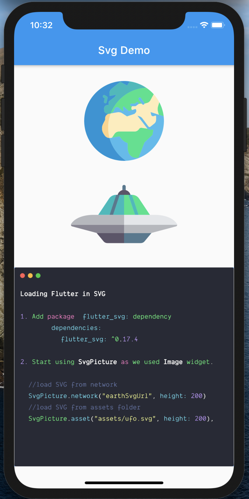

# SVG and Flair Animation Demo app

This sample is build for tip number #60 and #61 of [❤️Awesome Flutter ❤️ tips and tricks ❤️](https://github.com/erluxman/awesomefluttertips)

Initially this repo contains basic usage of SVG and Flare files, but in future I want to develop this repo as a repo to demonstrate animations and vector graphics in Flutter

## Using SVG

Even though flutter doesn't support any vector graphics out of the box, the package `flutter_svg` can render `svg` into Flutter app.

1. Add dependency :
        `flutter_svg: ^version`

2. Start using it like Flutter `Image` Widget.

        //load SVG from network
        SvgPicture.network("https://image.flaticon.com/icons/svg/124/124555.svg", height: 200)

        //load SVG from assets folder
        SvgPicture.asset("assets/ufo.svg", height: 200)

[visit flutter_svg](https://pub.dev/packages/flutter_svg#-readme-tab-)

## Using Flare/rive

Similar to vector graphics, Flutter doesn't support vector animation natively. [Rive (rive.app)](https://rive.app/explore) helps with amazing vector animations in Flutter.

1. Add flare in `pubspec.yaml`:

        flare_flutter: ^version

2. Download flare files from [rive.app](https://rive.app/explore) & put those `.flr` files into `assets/` folder:

        assets:
            - assets/

3. Start using `FlareActor` widget.

        FlareActor(
            "assets/world.flr",

            //🚨Caution🚨, you can find 👉 #animation name in
            //left bottom 👈👇 of rive.app designer tool when
            //Animation tab is selected

            animation: "world")

[visit flare_flutter](https://pub.dev/packages/flare_flutter)

